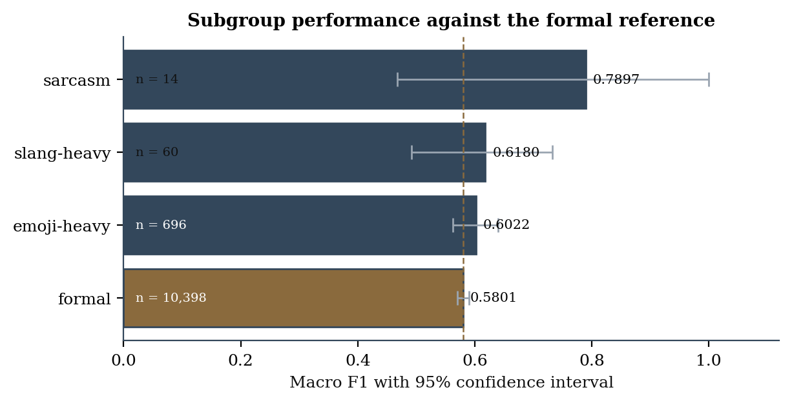
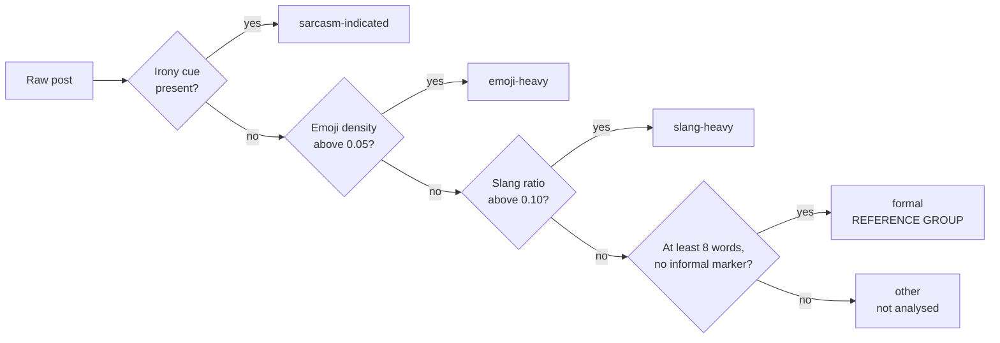
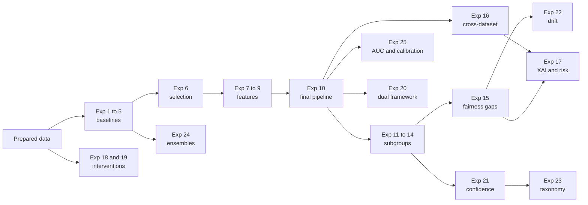
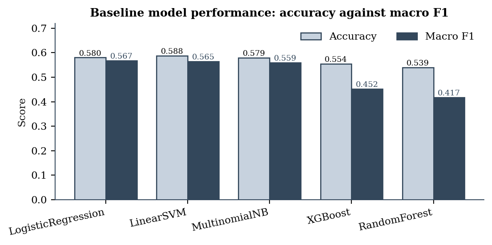
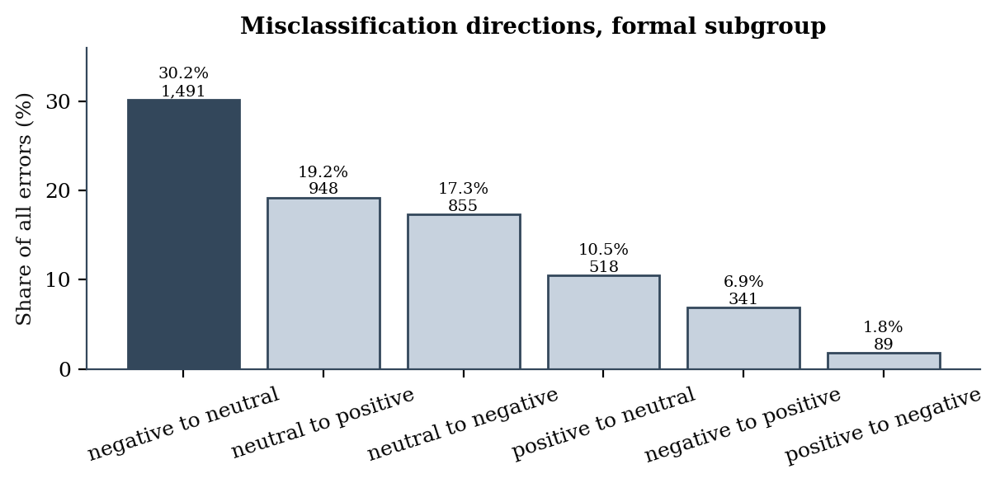
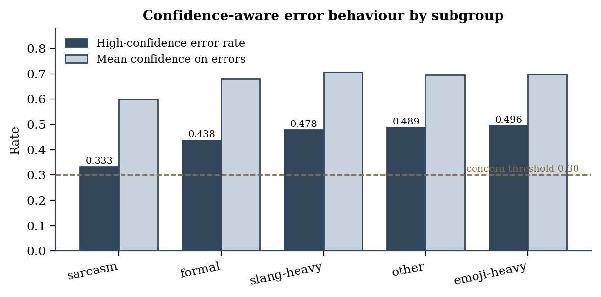
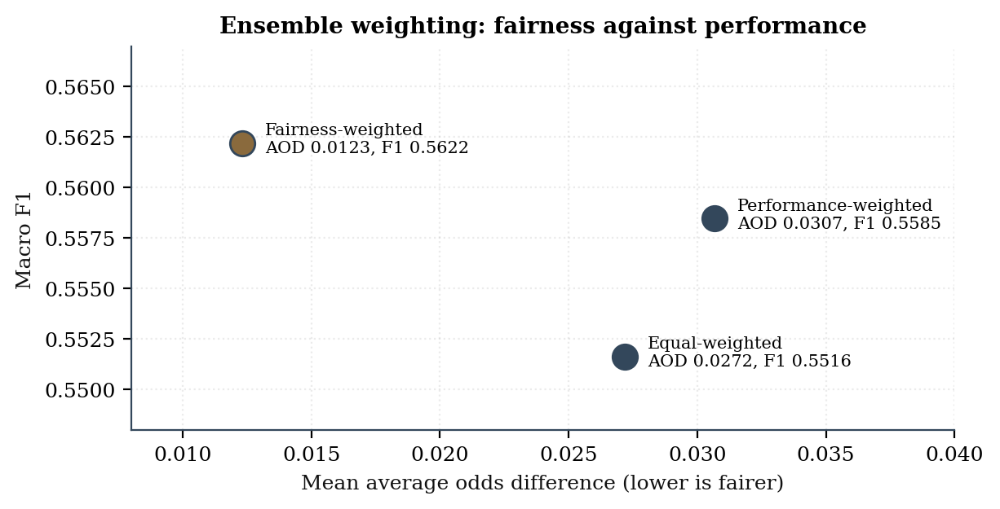

# AN ETHICAL RISK ASSESSMENT OF SENTIMENT ANALYSIS MODELS IN SOCIAL MEDIA MONITORING WITH A FOCUS ON BIAS, INCLUSIVITY, AND MISCLASSIFICATION PATTERNS

MSc thesis implementation, Machine Learning and Artificial Intelligence, Liverpool John
Moores University, by **Abhishek Tomar** (PN1196973).

This repository is the implementation workspace for the thesis. It contains the shared
utility module, the notebooks for all twenty-five experiments, and the assembled result
tables reported in Chapter 5.

## The problem

Sentiment analysis systems used for social media monitoring are judged almost entirely
on aggregate accuracy measured across a whole test set. A single figure of that kind
records how often a model is correct and says nothing about whose writing it handles
poorly. A classifier can therefore look serviceable while failing consistently on one
kind of writing, and nothing in conventional reporting would reveal it.

Fairness research in natural language processing has built mature measurement apparatus,
but has applied it almost entirely to demographic categories such as gender, ethnicity
and age. Writing style has not been treated as a grouping variable to which the same
indicators apply.

This project applies that apparatus to **writing style**. Four linguistic subgroups are
defined within the same dataset, with formal text as the reference group, and every
model is assessed on performance, fairness, error mechanism, confidence calibration,
explainability and cross-dataset stability rather than on accuracy alone.

## The headline finding

The audit reversed the direction of disadvantage it was built to detect. **Formal text,
designated as the reference group precisely because it resembles conventional training
data, proved the weakest of the four subgroups.**



The ordering holds across all five model families and under threshold-independent
measures, so it is not an artefact of one model or of the decision threshold. The
sarcasm interval spans 0.4675 to 1.0000 on 14 instances, so the finding rests on the
emoji-heavy subgroup and the AUC evidence rather than on sarcasm.

## The four subgroups

| Subgroup | Criterion | Role |
|---|---|---|
| Sarcasm-indicated | Matches a predefined cue set of irony hashtags and conventional ironic phrases | Compared against formal |
| Emoji-heavy | Emoji density above 0.05 | Compared against formal |
| Slang-heavy | Lexicon-matched informal terms above 0.10 of the post | Compared against formal |
| Formal | Conventional language, at least 8 words, no informal marker | **Reference group** |

A post matching more than one criterion is resolved by a fixed precedence: sarcasm,
then emoji-heavy, then slang-heavy, then formal. Posts matching none are retained in a
residual category and not analysed. Tagging runs on raw text, before cleaning, because
cleaning removes the emoji that two of the criteria depend on.



## The 25-experiment programme

| # | Experiments | Block |
|---|---|---|
| 1 to 5 | Five classical models on a shared TF-IDF representation | Baselines |
| 6 | Model selection on macro F1 | Baselines |
| 7 to 9 | Character n-grams, social-media features, hybrid | Feature engineering |
| 10 | Cross-validated grid search across all five families | Tuning |
| 11 to 14 | One subgroup each, by filtering a single prediction set | Subgroup evaluation |
| 15 | Cross-subgroup fairness gaps against the reference | Subgroup evaluation |
| 16 | Transfer to SemEval-2014 and Sentiment140 | Robustness |
| 17 | SHAP and LIME, and ethical-risk assembly | Explainability |
| 18 | Imbalance correction scored on fairness, not recall | Novelty 1 |
| 19 | Loss function and tree-growth strategy as fairness variables | Novelty 2 |
| 20 | Dual-framework audit, AI Fairness 360 against Fairlearn | Novelty 6 |
| 21 | High-confidence error rate and mean confidence on errors | Novelty 4 |
| 22 | Fairness drift across datasets | Novelty 5 |
| 23 | Explanation-based error taxonomy | Novelty 3 |
| 24 | Equal, performance and fairness weighted ensembles | Novelty 7 |
| 25 | ROC-AUC, PR-AUC and expected calibration error | Extended metrics |

**Fixed across every experiment**, so any difference is attributable to the factor
deliberately varied: random seed 42, the same data partitions, the same subgroup
definitions, the same evaluation code, and the same feature set within each comparison.

Fourteen of the twenty-five experiments fit no model at all. They operate on stored
prediction files, which is what guarantees that the fairness audit, confidence analysis,
error taxonomy, drift comparison and calibration assessment are all analysing the same
model rather than separately refitted ones.



## Datasets

| Dataset | Rows | Classes | Role |
|---|---|---|---|
| TweetEval | 59,899 | 3 | Primary: training, tuning, subgroup and fairness evaluation |
| SemEval-2014 | 7,694 | 3 | External validation, formal review register |
| Sentiment140 | 100,000 sampled | 2 | External validation, high informal content |

Sentiment140 carries no neutral class, so cross-dataset comparison against it is
restricted to a common binary label space. TweetEval's native train, validation and
test partitions are used unchanged at 45,615, 2,000 and 12,284.

## Repository layout

```
Implementation/
  thesis_utils.py            shared layer: seed, thresholds, reference subgroup,
                             cleaning, tagging, metrics, fairness, bootstrap,
                             paired tests, risk scoring
  NB5_Preprocessing.ipynb    cleaning, partitions, subgroup tagging
  NB6_Baselines.ipynb        Experiments 1 to 6
  NB7_Features_Tuning.ipynb  Experiments 7 to 10
  NB8_Subgroups.ipynb        Experiments 11 to 15
  NB9_CrossDataset_XAI.ipynb Experiments 16 and 17
  NB10 to NB16               Experiments 18 to 24, one notebook per novelty
  NB17R_Results_Assembly     assembles every result table, no new computation
  NB18_Extended_Metrics      Experiment 25
  NB21_Transformer_Baseline  scaffolded, not completed, see Known limitations

  results/                   42 result tables as CSV
  results/assembled/         the 17 tables reported in Chapter 5
  requirements.txt           library versions

docs/figures/                charts embedded in this README

Excluded by .gitignore, each rebuilt by running the notebooks in order:

  data/          prepared partitions, fitted vectorisers, feature matrices   63 MB
  models/        serialised estimators                                      609 MB
  predictions/   one file per model output                                   10 MB

Dataset_Exploration/EDA/     exploratory notebooks, one per corpus plus a
                             cross-dataset comparison
```

The exclusion is a size constraint rather than a design choice. `models/` alone is
609 MB, of which the Random Forest estimator is 582 MB, above GitHub's 100 MB limit
for a single file. The source corpora are excluded separately, since each carries its
own licence and should be obtained from its original distributor.

The result tables **are** tracked. Every figure reported in Chapter 5 can be checked
against `results/assembled/` without regenerating anything.

Every prediction file stores the true label, the predicted label, the full class
probability vector, the confidence, a correctness flag and the subgroup tag for every
test instance. That schema is what allows the later analyses to reuse stored output
instead of refitting.

## Selected results

| | |
|---|---|
|  |  |
| Accuracy against macro F1 across the five baselines | Misclassification directions; negative read as neutral dominates at 30.2% |
|  |  |
| High-confidence error rate above the 0.30 threshold in every subgroup | Fairness weighting cuts disparity 55% with no accuracy cost |

## Validation notes

Four issues were found and handled during development. They are recorded here rather
than left implicit.

| Issue | Resolution |
|---|---|
| Fairlearn equal opportunity compared a correctness vector against itself and returned zero everywhere | Fixed 9 August 2026. All fairness results were regenerated afterwards |
| Sentiment140 labels were derived from emoticons still present in the text, a direct label leak | An emoticon-removal step was applied to that corpus alone, reducing 6,562 affected instances to zero |
| `SUBGROUPS` declares a `mixed` category but the tagging function emits `other` | `other` is what is written to every file and used throughout. Documented in the thesis, Section 4.3.4 |
| The emoji-heavy subgroup was identified as marginal at roughly 1,655 posts across all three corpora | The 0.05 threshold was **not** loosened, since adjusting a subgroup definition after observing its size would make the definition contingent on the data. The size is reported as a limitation instead |

## Known limitations

**The transformer baseline was not completed.** `NB21_Transformer_Baseline.ipynb` loads
a pre-trained sentiment model on a GPU runtime, tokenises both partitions and computes
class weights, then stops before the training loop. No transformer predictions exist and
none are reported anywhere in the thesis.

**Permutation feature importance was skipped.** Experiment 25 was designed to compute it
and compare its ranking against SHAP through Jaccard overlap, giving a third independent
check on the explainability findings. The hybrid feature matrices had not been persisted
by the feature-building stage, so the step could not run. The explainability evidence
therefore rests on SHAP and LIME together.

Both are documented in the thesis at Section 4.10.3 and carried into Chapter 6 as
further work.

## Reproducing

```bash
pip install -r requirements.txt
```

The notebooks are written for Google Colab with Drive-mounted storage. Run them in
numerical order; each stage writes artefacts that later stages load rather than
recompute. `NB17R_Results_Assembly` performs no new computation and can be re-run at any
point to rebuild the result tables from existing outputs.

## Thesis

The full dissertation describes the methodology in Chapter 3, the implementation in
Chapter 4, and the results in Chapter 5. The central finding is that the expected
direction of disadvantage did not appear: formal text, designated as the reference group
precisely because it resembles conventional training data, proved the weakest performer
of the four subgroups, and the ordering held across all five models and under
threshold-independent measures.
